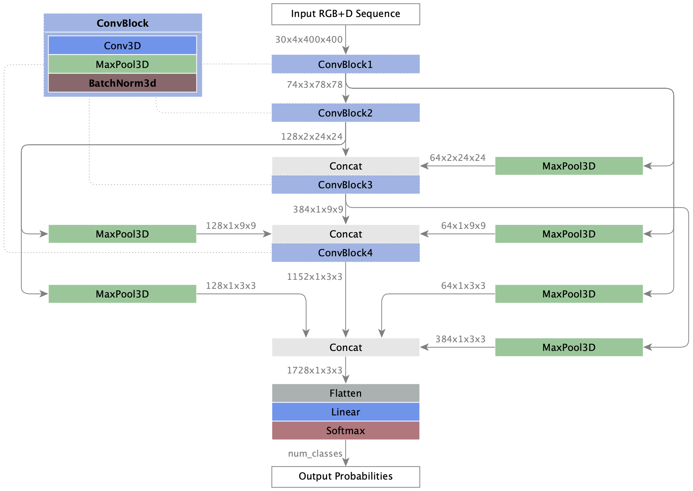
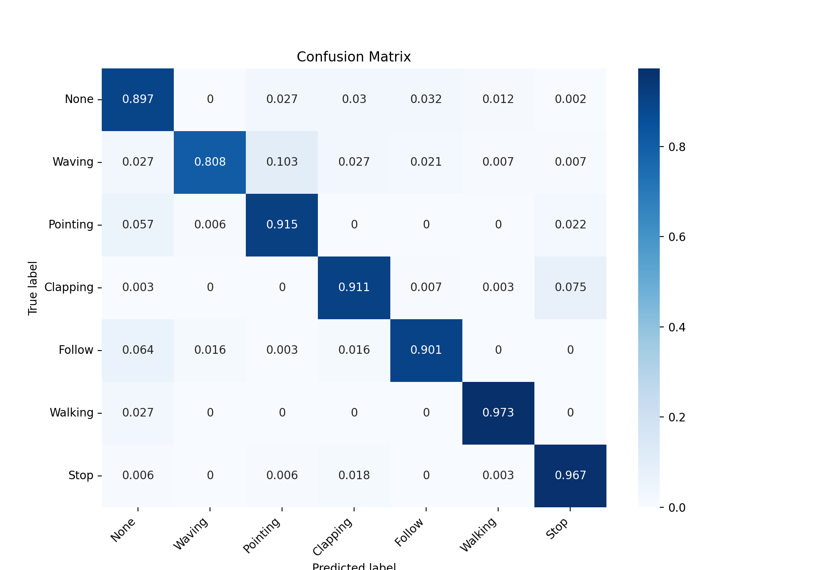

Author: [Robert Schulz, University of Technology Chemnitz, Germany](mailto:schulzr256@gmail.com)

# MSCONV3D
A multistage 3D convolution-based model for Human Action Recognition

## Overview

In this work, we introduce MSCONV3D, a multistage 3D convolution-based model for HAR that achieves state-of-the-art performance on the UCF101 dataset while significantly reducing the number of parameters compared to the top-3 existing models. This makes MSCONV3D well-suited for real-time applications and computationally efficient deployments.

_**Figure 1.** Illustration of the MSCONV3D model architecture. The model consists of multiple convolutional blocks (ConvBlock), each incorporating 3D convolution, pooling, and normalization layers. The output of each ConvBlock is down sampled through pooling and subsequently fed into the following layers, where it is concatenated with outputs from subsequent layers. This design enables multi-stage feature extraction, comparable to skip connections, allowing the model to retain spatial and temporal information across different scales. The final classification layers include a flattening operation, a fully connected layer, and a softmax activation to produce output probabilities._

# Training
